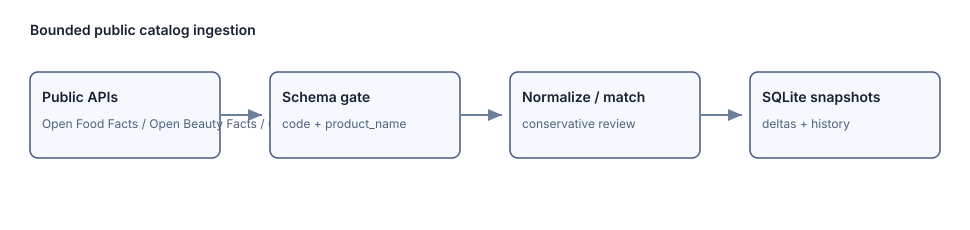

# Supplier Data Pipeline

Инкрементальный импорт публичных товарных каталогов: контроль схемы,
нормализация, консервативное сопоставление, snapshots, дельты и очередь ручной
проверки. В репозитории есть локальные контрактные тесты и отдельный
воспроизводимый запуск по трём реальным открытым каталогам.



## Реальный запуск

`studies/openfacts-catalog-run-2026-08-10/` фиксирует read-only запуск от
2026-08-10 для Open Food Facts, Open Beauty Facts и Open Pet Food Facts. Это
три публичных каталога одного API-семейства, а не коммерческие supplier feeds.
Для каждого сделан ровно один ограниченный запрос `v2/search`; результаты,
хэши ответов, поля схемы, дельты и ошибки находятся в
[results.json](studies/openfacts-catalog-run-2026-08-10/results.json) и
[source-manifest.json](studies/openfacts-catalog-run-2026-08-10/source-manifest.json).
Зафиксированный запуск принял 26 из 36 полученных записей за 16.872 секунды:
10 записей без `product_name` были отклонены схемным gate, ошибок источников не
было. Между тремя разными каталогами не встретилось точного barcode-match и не
появилось кандидатов для ручной проверки; это факт этого small run, а не
обещание качества сопоставления.


Полные сырые ответы не коммитятся. Их местоположение, SHA-256 и размер
сохранены в manifest; так репозиторий не распространяет чужое содержимое
каталогов и всё же позволяет проверить происхождение результатов. Детали
источников, лицензии и лимиты запросов описаны в
[docs/source-policy.md](docs/source-policy.md).

## Что проверяет код

- `OpenFactsSearchAdapter` задаёт идентифицирующий User-Agent, ограничивает
  частоту запросов и валидирует обязательные `code` и `product_name` до записи.
- `Pipeline` сохраняет checkpoint после каждой страницы, отделяет staging от
  commit и переносит только последний незавершённый batch.
- SQLite и SQLAlchemy Core репозитории хранят snapshots, `created`/`updated`/
  `missing`/`restored` дельты и ручные решения вместе с успешным batch.
- Matcher автоматически принимает только сильный exact-кандидат; слабые и
  равные кандидаты попадают в review queue.
- Транспортные контрактные тесты моделируют retry, HTTP 429/500, timeout,
  broken HTML, schema drift, conditional fetch, restart, pagination и
  идемпотентность batch.

Диаграмма и сценарий: [docs/architecture.md](docs/architecture.md). Пошаговый
запуск: [docs/runbook.md](docs/runbook.md).

## Быстрый старт

```bash
python3.12 -m venv .venv
.venv/bin/python -m pip install -e '.[dev]'
PYTHONPATH=src .venv/bin/python -m pytest -q
```

Контрольный API запускает только явно синтетические localhost/.local/.test
источники, чтобы случайно не превратить HTTP endpoint в произвольный crawler:

```bash
PYTHONPATH=src .venv/bin/uvicorn supplier_pipeline.api:app
```

## Ограничения

- В публичном запуске нет цен и остатков: эти поля не выдумываются, если API
  их не вернул.
- HTML и Playwright адаптеры покрыты локальными контрактами; в данном запуске
  они не обращались к внешнему сайту.
- Один bounded search page не является полным зеркалом каталога. Для массовой
  загрузки Open Facts рекомендует выгрузки CSV/JSONL.
- `bsl/ImportEndpoint.bsl` показывает границу конфигурационно-зависимого
  импорта 1С. Это не самостоятельный запускаемый модуль и не проверялось в
  реальной ИБ 1С.
- Нет auth, proxy policy, distributed worker coordination и PostgreSQL
  migration; SQLite-режим рассчитан на локальный single-writer запуск.
