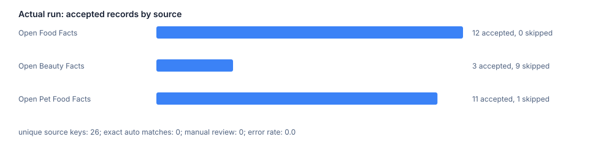

# Пайплайн товарных каталогов поставщиков

[](https://github.com/sergey-lastochkin/supplier-data-pipeline/actions/workflows/ci.yml)

**Загрузка карточек товаров из внешних источников с проверкой схемы, историей
изменений и очередью спорных совпадений — до того, как данные попадут в 1С.**



## Какую проблему решает

Прайсы и каталоги поставщиков приходят в разном формате, с пропусками и
дублями. Если грузить их в номенклатуру напрямую, появляются задвоенные
карточки и перезаписанные данные. Здесь каждая запись проходит проверку до
записи, изменения хранятся как история, а неоднозначные совпадения не
сливаются автоматически, а уходят человеку на проверку.

## Для кого

- Компании, которые регулярно загружают в 1С номенклатуру или цены поставщиков.
- Разработчики, которым нужен каркас импорта с контрольными точками и
  транзакционной записью.

## Запуск за 2 минуты

```bash
git clone https://github.com/sergey-lastochkin/supplier-data-pipeline.git
cd supplier-data-pipeline
python3.12 -m venv .venv
.venv/bin/python -m pip install -e '.[dev]'
PYTHONPATH=src .venv/bin/python -m pytest -q
PYTHONPATH=src .venv/bin/uvicorn supplier_pipeline.api:app
```

Контрольный API принимает только синтетические источники (`localhost`, `.local`,
`.test`) и не используется как произвольный crawler. Повтор публичного прогона —
[runbook](docs/runbook.md).

## Пример результата

Прогон на первой странице трёх открытых каталогов (Open Food Facts, Open Beauty
Facts, Open Pet Food Facts): получено 36 записей, 26 прошли проверку схемы, 10
без `product_name` отклонены до записи, ошибок источников нет, 15,2 с. Точных
совпадений штрихкодов между каталогами не нашлось. Хэши ответов и итог —
в [results.json](studies/openfacts-catalog-run-2026-08-10/results.json).

Что делает код: адаптер проверяет `code` и `product_name`, ограничивает частоту
запросов и сохраняет контрольную точку после каждой страницы; SQLite хранит
снимки, изменения и решения по спорным совпадениям в одной транзакции; сильное
точное совпадение принимается автоматически, слабые остаются в очереди.

## Ограничения

- Публичный прогон маленький (одна страница на источник) и показывает механику,
  а не качество сопоставления на реальном каталоге поставщика.
- Цен и остатков в прогоне нет — открытые API их не отдают.
- `bsl/ImportEndpoint.bsl` иллюстрирует границу импорта в 1С и не запускался в
  реальной базе.
- SQLite-режим рассчитан на один процесс записи; прокси, распределённых воркеров
  и миграций PostgreSQL нет.

## Автор и контакты

Сергей Ласточкин — интеграции и автоматизация вокруг 1С и Python.
Telegram: [@metaanswer](https://t.me/metaanswer).
