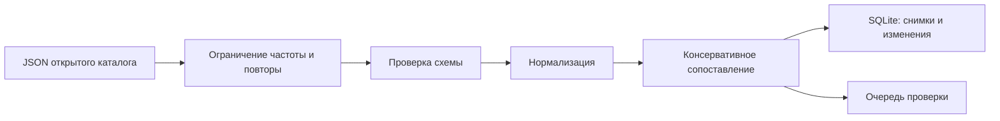

# Поток и границы системы

Адаптер преобразует поля внешнего API в общий контракт `Product`. Для Open
Facts обязательны только штрихкод `code` и `product_name`; `brands` может быть
пустым, а цена и остаток намеренно не конструируются. Если ответ не содержит
списка `products` или обязательных полей в схеме, пакет завершается ошибкой
до фиксации данных.

Промежуточные записи, кандидаты проверки и курсор находятся в staging. Только
одна успешная транзакция делает видимыми продукты, снимки, изменения и решения.
После сбоя новый пакет продолжает последнюю контрольную точку. Это локальный
SQLite-процесс, а не распределённая exactly-once обработка.

`bsl/ImportEndpoint.bsl` оставлен как форма обменной границы 1С, но конкретные
имена объектов и вызовов зависят от конфигурации. Файл не является доказательством
интеграции с реальной ИБ.
