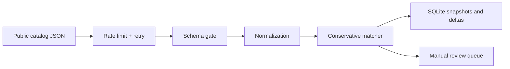

# Поток и границы системы

Adapter преобразует поля внешнего API в общий контракт `Product`. Для Open
Facts обязательны только barcode `code` и `product_name`; `brands` может быть
пустым, а цена и stock намеренно не конструируются. Если ответ не содержит
списка `products` или обязательных полей в схеме, batch завершается ошибкой
до commit.

Промежуточные записи, review-кандидаты и cursor находятся в staging. Только
одна успешная транзакция делает видимыми продукты, snapshots, дельты и review.
После сбоя новый batch продолжает последний checkpoint. Защита не претендует
на distributed exactly-once семантику: это локальный SQLite процесс.

`bsl/ImportEndpoint.bsl` оставлен как форма обменной границы 1С, но конкретные
имена объектов и вызовов зависят от конфигурации. Файл не является доказательством
интеграции с реальной ИБ.
