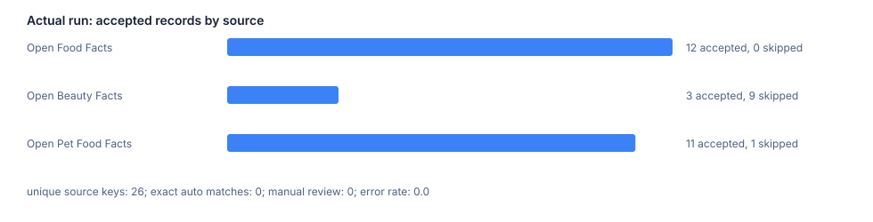

# Результаты публичного запуска 2026-08-10

Команда и параметры сохранены в [runbook.md](runbook.md). Запуск выполнил три
read-only запроса с `page_size=12` и паузой 7 секунд между источниками.
`results.json` привязан к commit кода и содержит SHA-256 каждого внешнего
ответа. Сырые JSON были сохранены вне Git и не приложены к репозиторию.

| Source | Получено | Принято | Отклонено gate | Причина | Дельты |
| --- | ---: | ---: | ---: | --- | --- |
| Open Food Facts | 12 | 12 | 0 | - | 12 created |
| Open Beauty Facts | 12 | 3 | 9 | отсутствует `product_name` | 3 created |
| Open Pet Food Facts | 12 | 11 | 1 | отсутствует `product_name` | 11 created |

Итог: 26 принятых записей, 26 уникальных source key и normalized SKU, 0 ошибок
источников, 0 exact auto matches, 0 manual review, 15.162 секунды. Нулевой
match rate в этом запуске ожидаем для трёх разных товарных доменов и явно не
интерпретируется как качество общего алгоритма.

Ответы фактически содержали `code`, `product_name`, `brands`, `quantity`,
`last_modified_t`, `url`; у Beauty и Pet Food дополнительно пришёл
`ecoscore_tags`. Наблюдаемые поля и SHA-256 зафиксированы в
[source-manifest.json](../studies/openfacts-catalog-run-2026-08-10/source-manifest.json).

